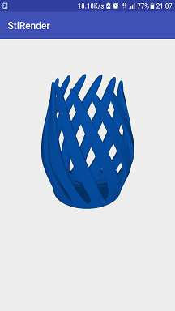

# Android下实现STL模型3D渲染

## STL文件

STL文件是在计算机图形应用系统中，用于表示三角形网格的一种文件格式，是最多快速原型系统所应用的标准文件类型。

 STL文件有两种：一种是ASCII明码格式，另一种是二进制格式。 

- **ASCII格式**

ASCII码格式的STL文件逐行给出三角面片的几何信息，每一行以1个或2个关键字开头。

在STL文件中的三角面片的信息单元 facet 是一个带矢量方向的三角面片，STL三维模型就是由一系列这样的三角面片构成。

整个STL文件的首行给出了文件路径及文件名。

在一个 STL文件中，每一个facet由7 行数据组成，

facet normal 是三角面片指向实体外部的法矢量坐标，

outer loop 说明随后的3行数据分别是三角面片的3个顶点坐标，3顶点沿指向实体外部的法矢量方向逆时针排列。

ASCII格式的STL 文件结构如下： 

```c++
//字符段意义
solidfilenamestl//文件路径及文件名
facetnormalxyz//三角面片法向量的3个分量值
outerloop
vertexxyz//三角面片第一个顶点坐标
vertexxyz//三角面片第二个顶点坐标
vertexxyz//三角面片第三个顶点坐标
endloop
endfacet//完成一个三角面片定义
 
......//其他facet
 
endsolidfilenamestl//整个STL文件定义结束
```


- **二进制格式**

二进制STL文件用固定的字节数来给出三角面片的几何信息。

文件起始的80个字节是文件头，用于存贮文件名；

紧接着用 4 个字节的整数来描述模型的三角面片个数，

后面逐个给出每个三角面片的几何信息。每个三角面片占用固定的50个字节，依次是:

3个4字节浮点数(角面片的法矢量)

3个4字节浮点数(1个顶点的坐标)

3个4字节浮点数(2个顶点的坐标)

3个4字节浮点数(3个顶点的坐标)个

三角面片的最后2个字节用来描述三角面片的属性信息。

一个完整二进制STL文件的大小为三角形面片数乘以 50再加上84个字节。

二进制格式的STL 文件结构如下： 

```c++
UINT8//Header//文件头
UINT32//Numberoftriangles//三角面片数量
//foreachtriangle（每个三角面片中）
REAL32[3]//Normalvector//法线矢量
REAL32[3]//Vertex1//顶点1坐标
REAL32[3]//Vertex2//顶点2坐标
REAL32[3]//Vertex3//顶点3坐标
UINT16//Attributebytecountend//文件属性统计
```

## 渲染效果

源码下载地址：https://github.com/wei-gong/StlRender


